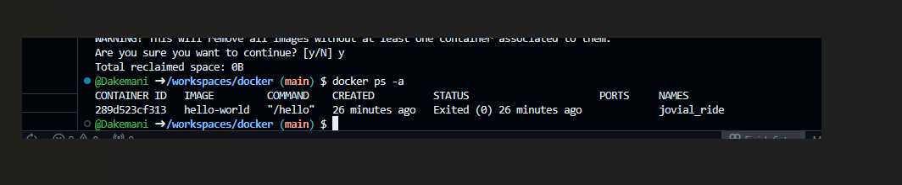
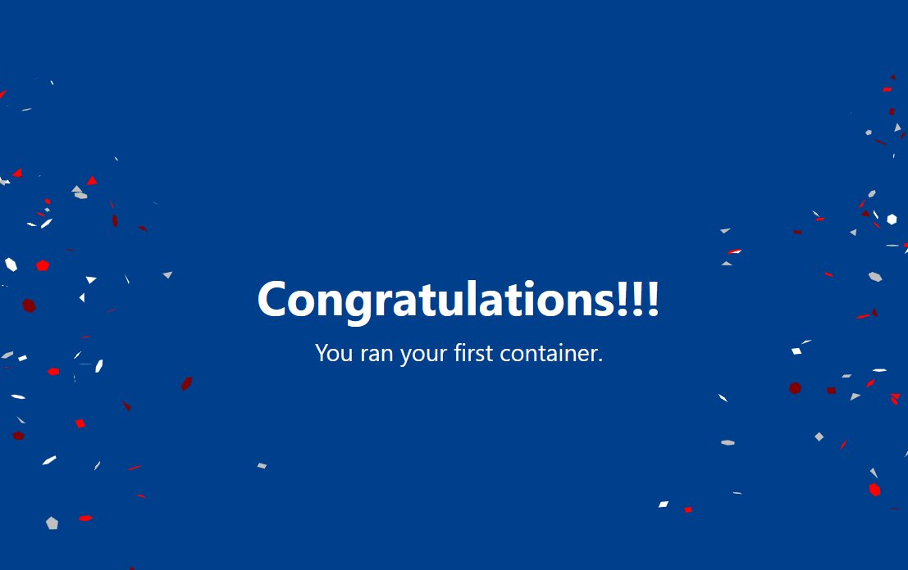
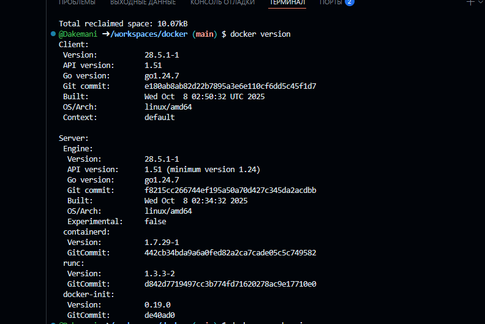

# docker
Вот готовый файл `README.md`, оформленный по образцу из методички.  
Я описал все шаги, которые ты выполнил, и оставил пометки `[ВСТАВИТЬ СКРИНШОТ]` — просто замени их на свои изображения.

---

```markdown
# Практическая работа с Docker на примере готового образа

В этой работе я познакомился с основами Docker: научился проверять свободные порты, загружать образы, запускать контейнеры, заходить внутрь контейнера и устанавливать дополнительные приложения.

---

## 1. Проверка доступности порта 8080

Перед запуском контейнера убедился, что порт 8080 не занят другими процессами.

**Команда для Linux/Mac/WSL:**

```bash
netstat -tuln | grep :8080
```

**Результат:** команда ничего не вернула — порт свободен.

> [ВСТАВИТЬ СКРИНШОТ ВЫВОДА КОМАНДЫ]

---

## 2. Запуск контейнера с веб-приложением

Загрузил образ и запустил контейнер с именем `webapp`:

```bash
docker run -d -p 8080:80 --name webapp docker/docker-webapp
```

> **Примечание:** в оригинальном задании указано `docker/docker/webapp`, но такой образ не существует. Вероятно, имелся в виду учебный образ `docker/docker-webapp` (или аналогичный). Если образ не загружается, можно использовать `nginx` для теста.

Проверил, что контейнер запущен:

```bash
docker ps -a
```



Открыл в браузере `http://localhost:8080` — приложение работает.

> 

---

## 3. Вход в контейнер и настройка

Зайти внутрь контейнера с интерактивной оболочкой:

```bash
docker exec -it webapp /bin/sh
```


## 4. Установка дополнительных пакетов

Обновил список пакетов и установил `fastfetch` (современная альтернатива `neofetch`):

```bash
apt update && apt upgrade -y
apt install -y fastfetch
```


Запустил `fastfetch`, чтобы увидеть информацию о системе внутри контейнера:

```bash
fastfetch
```


---

## 5. Проверка Docker на хосте

Перед началом работы убедился, что Docker установлен и работает:

```bash
docker version
```



---

## 6. Очистка системы (опционально)

Чтобы освободить ресурсы, остановил и удалил все контейнеры, а затем удалил неиспользуемые образы.

**Просмотр всех контейнеров:**

```bash
docker ps -a
```

**Остановка всех запущенных:**

```bash
docker stop $(docker ps -q)
```

**Удаление остановленных контейнеров:**

```bash
docker container prune -f
```

**Просмотр образов:**

```bash
docker images
```

**Удаление всех неиспользуемых образов:**

```bash
docker image prune -a -f
```


---

## Вывод

В ходе работы я научился:

- проверять занятость портов;
- запускать контейнеры с пробросом портов;
- заходить внутрь контейнера и выполнять команды;
- устанавливать дополнительное ПО в контейнер;
- управлять контейнерами и образами.
